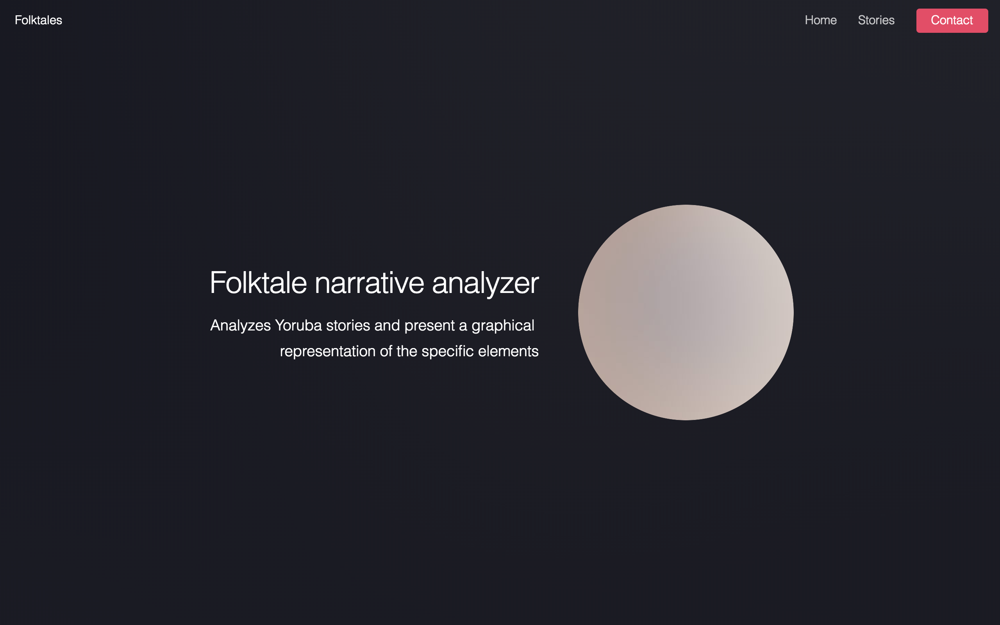

# Folktales Narrative Analyzer

Analyzes Yoruba stories and present a graphical representation of the specific elements




## Table of contents

- [Dependencies](#dependecies)
- [Setup](#setup)
- [Contribution](#contribution)
 
## Dependencies

- [Python ^3.6.4](http://python.org/)
- [Flask](http://flask.pocoo.org/) – `pip install flask`
- [NLTK](http://nltk.org) - `pip install nltk`

## Setup

```
$ pip install --upgrade pip
```

Then you probably want to work from your local PC:

Start by cloning the project from github:
```
$ cd ~/Documents/
$ git clone https://github.com/victor-iyiola/folktales.git
$ cd folktales
``` 

or:

You can download the `.zip` project files [here](https://github.com/victor-iyiola/folktales) and extract the project files.

```
$ cd <your_download_dir>
$ cd folktales
```

Then install these requirements:
```
$ pip install --upgrade -r requirements.txt
```
     
Finally, start the project:
```
$ python __init__.py
```

## Contribution

This project is opened under [MIT 2.0 license](https://github.com/victor-iyiola/folktales/blob/master/LICENSE).